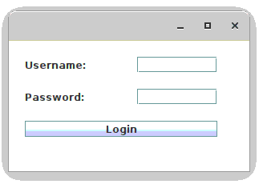
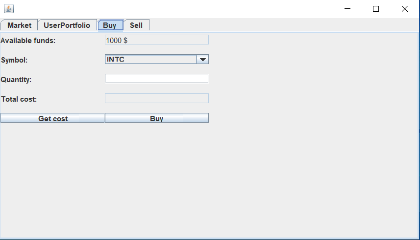
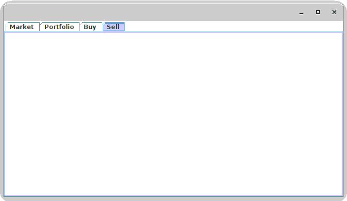

**Stocks Portfolio Management Application**

# Developed a Java application for managing stock portfolios, including the following features:

#### User authentication (without credential validation)
#### Viewing available market stocks and their current prices
#### Displaying the user’s portfolio with owned stocks and available balance
#### Buying and selling stocks, restricted by available funds

Note: The project uses Lombok. 
Please install the Lombok plugin. **In IntelliJ: File->Settings...->Plugins - search 'Lombok'**

## 1 

Implement a basic stock portfolio tracker application.

The aplication should provide following functionalities:
- Authentication (Login) - finish the login implementation. Currently, the credentials are not verified; anyone can access the application.

- View market stocks and their current value - this feature is implemented and can be used as reference for next exercises;

- View user portofolio owned stocks
    - View owned stocks in a table view similar to Market;
    - For each owned stock display in table followings: symbol, quantity, price per unit, total price of the position;
    - Also add available funds (cash).

- Buy stock:
    - Implement "Buy" button functionality;
    - Buy is limited by available cache funds (stored in Portfolio class, attribute "cash");

- Sell stock
    - Create user interface similar to Buy interface
    - Symbol dropdown button should display only stocks owned by user;
    - When the sell is completed, the available funds should increase with the value of the transaction;

 

### Implementation notes

Note 1 - Stock symbols are hardcoded in StockMarketQueryService      private String[] symbols = new String[] {"INTC", "BABA", "TSLA", "AIR.PA", "MSFT", "AAPL", etc.}; You can add your own symbol as long as correspond to some real market symbols.

Note 2 - For getting financial market information the application uses htmlunit library, which consumes the Yahoo Finance API:

        <dependency>
            <groupId>net.sourceforge.htmlunit</groupId>
            <artifactId>htmlunit</artifactId>
            <version>2.70.0</version>
        </dependency>
